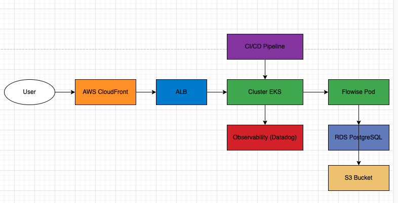

# Documentação do Projeto: Deploy do Flowise em Arquitetura de Microsserviços

---

## Sumário

1. [Visão Geral do Projeto](#visão-geral-do-projeto)  
2. [Arquitetura](#arquitetura)  
3. [Infraestrutura](#infraestrutura)  
4. [Containerização e Orquestração](#containerização-e-orquestração)  
5. [Banco de Dados](#banco-de-dados)  
6. [Armazenamento](#armazenamento)  
7. [Rede e Segurança](#rede-e-segurança)  
8. [CI/CD](#cicd)  
9. [Backup e Recuperação de Desastres](#backup-e-recuperação-de-desastres)  
10. [Observabilidade (A Implementar)](#observabilidade)  
11. [Diagramas](#diagramas)  
12. [Instruções de Deploy](#instruções-de-deploy)  

---

## Visão Geral do Projeto

Este projeto implementa o Flowise em uma arquitetura de microsserviços utilizando Kubernetes (EKS) e AWS. O sistema é altamente disponível, escalável e seguro, com pipelines de CI/CD automatizados.

---

## Arquitetura

A solução é composta por:
- **Cluster Kubernetes (EKS)**: Para orquestrar os contêineres.
- **RDS PostgreSQL**: Banco de dados para armazenar metadados e configurações.
- **S3**: Armazenamento para backups e modelos de IA.
- **CloudFront**: Distribuição de conteúdo com proteção integrada e baixa latência.
- **VPC**: Isolamento e segurança de rede.

---

## Infraestrutura

**Ferramentas utilizadas**: Terraform  
**Componentes provisionados**:
- VPC com subnets públicas e privadas
- Cluster EKS
- RDS PostgreSQL
- Buckets S3
- Grupos de Segurança e WAF

---

## Containerização e Orquestração

**Ferramentas utilizadas**: Docker, Kubernetes  
**Passos principais**:
1. Dockerfile criado para o Flowise.
2. Manifests Kubernetes:
   - Deployments
   - Services
   - ConfigMaps
   - Secrets
3. HPA configurado para ajuste automático de pods.

---

## Banco de Dados

**Tecnologia utilizada**: RDS PostgreSQL  
**Configurações principais**:
- Multi-AZ habilitado.
- Backups automáticos configurados com retenção de 7 dias.
- Monitoramento ativo via CloudWatch.

---

## Armazenamento

**Tecnologia utilizada**: S3  
**Configurações principais**:
- Versionamento habilitado.
- Criptografia em trânsito e em repouso.
- Política de ciclo de vida configurada para exclusão de dados antigos.

---

## Rede e Segurança

**Configurações principais**:
- VPC com subnets segmentadas.
- Grupos de segurança restritivos.
- IAM Roles configuradas com permissões mínimas necessárias.
- CloudFront configurado para distribuição de conteúdo e segurança.

---

## CI/CD

**Ferramentas utilizadas**: GitHub Actions  
**Funcionalidades principais**:
- Deploy automatizado de infraestrutura com Terraform.
- Atualizações contínuas de imagens Docker e manifests Kubernetes.
- Testes automatizados de infraestrutura e fluxos de trabalho.

---

## Backup e Recuperação de Desastres

**Configurações principais**:
- Backups automáticos para RDS e S3.
- Estratégia de recuperação documentada:
  - Restaurar banco de dados RDS a partir de snapshots.
  - Recuperar dados e modelos de IA do S3.

---

## Observabilidade

**Objetivo**: Monitorar desempenho e rastrear fluxos de IA.  

**Plano (A Implementar)**:
1. **Integração com Datadog**:
   - Monitoramento de métricas do cluster Kubernetes e aplicações.
2. **Log Aggregation**:
   - Configurar Fluentd para centralizar logs.
3. **Tracing Distribuído**:
   - Utilizar OpenTelemetry para rastrear requisições entre serviços.

---

## Diagramas

### Diagrama de Arquitetura

> [Download](https://drive.google.com/file/d/10tDr94UsIP4l_Q-zqVq9LFHtobaj6Pyh/view?usp=sharing)

---

## Instruções de Deploy

1. **Clonar o Repositório**:
   ```bash
   git clone https://github.com/seu-repositorio/flowise-project.git
   cd flowise-project
   ```

2. **Provisionar Infraestrutura**:
   ```bash
   cd terraform
   terraform init
   terraform apply
   ```

3. **Deploy no Kubernetes**:
   ```bash
   kubectl apply -f app-deployment/deployment.yaml
    kubectl apply -f app-deployment/ingress.yaml
   ```

4. **Configurar CI/CD**:
   - Atualize os pipelines no arquivo `.github/workflows/deploy.yml`.

5. **Verificar a Implantação**:
   ```bash
   kubectl get pods -n flowise
   kubectl get services -n flowise
   ```

---

### Considerações Finais

O sistema está configurado para suportar cargas intensivas de IA, garantindo segurança e escalabilidade. A próxima etapa é implementar observabilidade para otimizar fluxos de trabalho e monitorar desempenho.  

**Contato para dúvidas**: [gaa.silva53@gmail.com]
